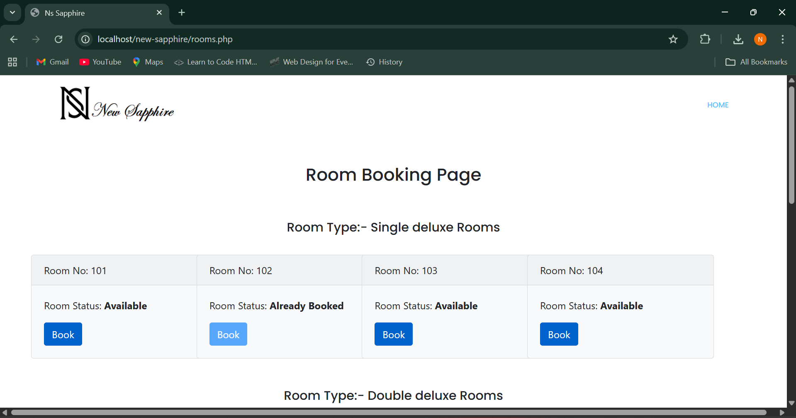
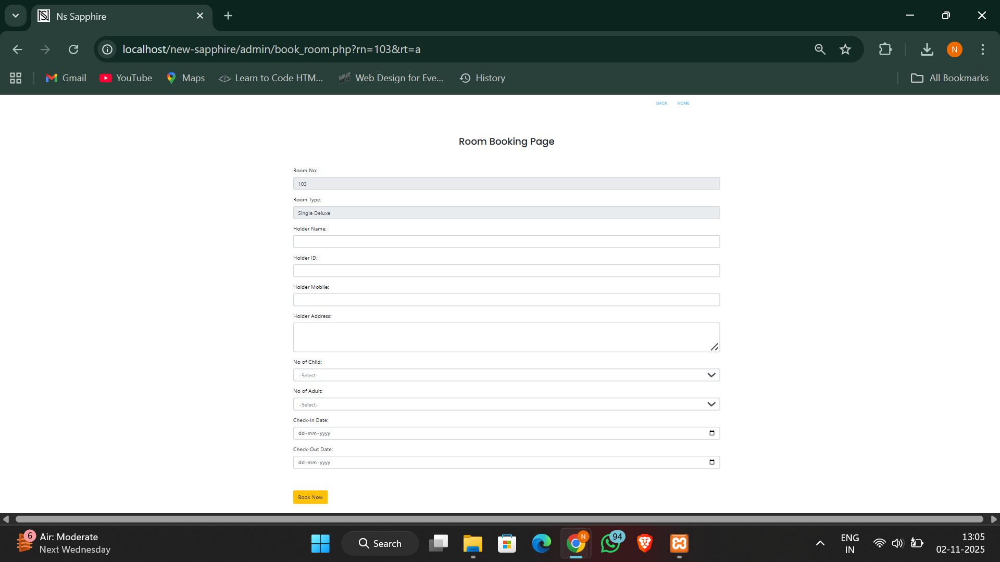
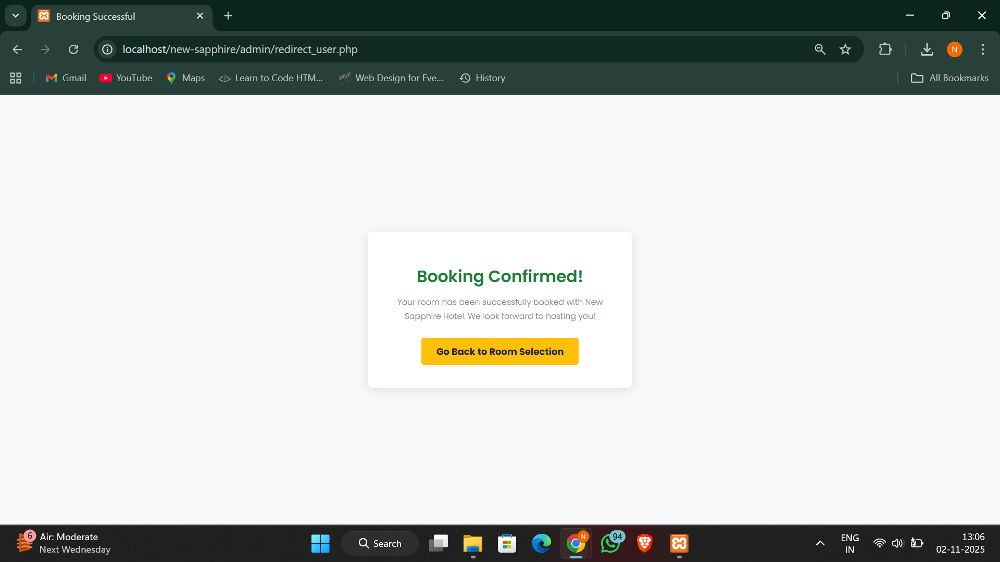
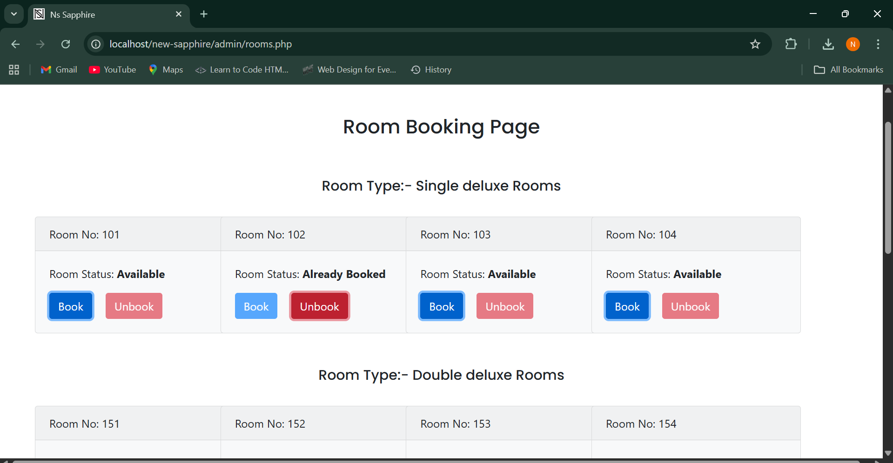

# 🏨 New Sapphire – Hotel Room Reservation System


**New Sapphire** is a full-stack hotel room reservation system built using **PHP, MySQL, HTML, CSS, and Bootstrap**, deployed locally through **XAMPP**.  
The application provides a **responsive user interface** for browsing available rooms and booking stays, while the backend manages **room availability, reservations, cancellations, and customer records** through an integrated **admin dashboard**.

This project offers hands-on experience across:
- **Frontend development** (UI layout, styling, responsiveness, form handling)
- **Backend logic** (PHP workflows, business rules, request handling)
- **Database design & integration** (MySQL relational schema, CRUD operations)
- **Full-stack application flow** (user → booking → admin → management)

Overall, New Sapphire demonstrates the implementation of a **complete full-stack web application** with real-world reservation lifecycle management.

---

## 🌟 Features

- Book hotel rooms with customer details
- Manage room availability status
- Maintain reservation & cancellation records
- Admin can view, update, and delete booking details
- Runs locally using XAMPP for testing & demonstration

---

## 🧠 Project Objectives

- Implement backend logic using **PHP**
- Practice database design and queries in **MySQL**
- Understand real-world flow of **hotel management systems**
- Learn **CRUD operations**, backend integration, and local deployment

---

## 🛠️ Tech Stack

| Area | Technology |
|-------|------------|
| Backend | PHP |
| Database | MySQL |
| Web Server | Apache (XAMPP) |
| Frontend Resources | HTML, CSS, Bootstrap |
| Scripting | JavaScript |
| Tools | VS Code, phpMyAdmin |

---

## 📁 Folder Structure

```
new-sapphire/
├── admin/                   # Admin dashboard & booking management
├── bootstrap-4.4.1/         # Bootstrap CSS & JS (local copy)
├── css/                     # Stylesheets
├── image/                   # Images used in UI
├── js/                      # JavaScript scripts
├── hotel.sql                # Database schema file
├── index.php                # Main landing page
└── rooms.php                # Rooms display / management page
```
---

## ⚙️ Installation & Setup

### **1️⃣ Install XAMPP**
Download: https://www.apachefriends.org/

### **2️⃣ Move project to XAMPP directory**
C:/xampp/htdocs/new-sapphire


### **3️⃣ Start required services**
- Open XAMPP Control Panel
- Start **Apache**
- Start **MySQL**

### **4️⃣ Import the database**
1. Go to → http://localhost/phpmyadmin  
2. Create a database named: `hotel`  
3. Click **Import**
4. Select the file → `hotel.sql`
5. Click **Go**

### **5️⃣ Run the project**
Open browser:
http://localhost/new-sapphire


---

## 🎯 How It Works

| Action | Description |
|--------|------------|
| Customer books a room | Booking entry created in DB |
| Admin checks dashboard | Views all reservations |
| Room status updates | Based on booking / cancellation |
| Records management | Add / update / delete reservation records |

---

---

## 📸 Screenshots

### 🏠 Homepage
| View | Image |
|-------|-------|
| Homepage |  |
| Homepage - Rooms Overview |  |

---

### 🛏 Rooms Display


---

### 📝 Room Booking Pages
| Step | Image |
|------|-------|
| Booking Form |  |
| Booking Details Submission |  |
| Booking Success Confirmation |  |

---

### 🧑‍💼 Admin Dashboard


---


## 🚧 Future Possibilities

- Individual login for admin & customers
- Payment integration (Razorpay / PayPal)
- Email confirmations for bookings
- Analytics dashboard for admins

---

## 🙋 Author

**Nikita Sisode**  
🔗 GitHub: https://github.com/Nikitasisode016 

> ⭐ *If you found this project helpful or interesting, please consider giving the repo a star!*


